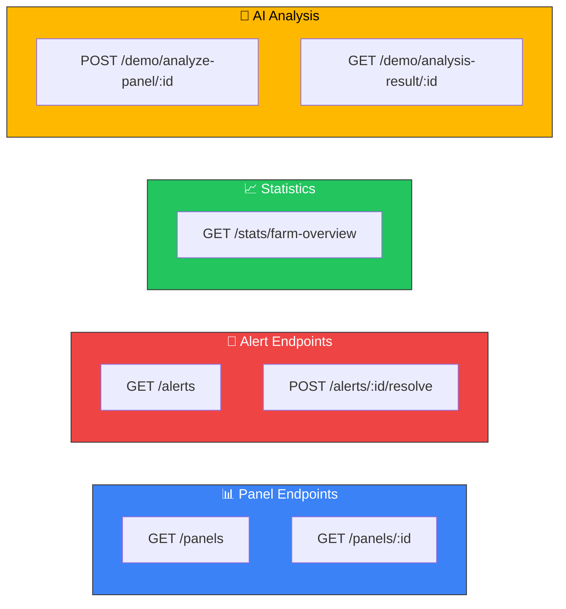
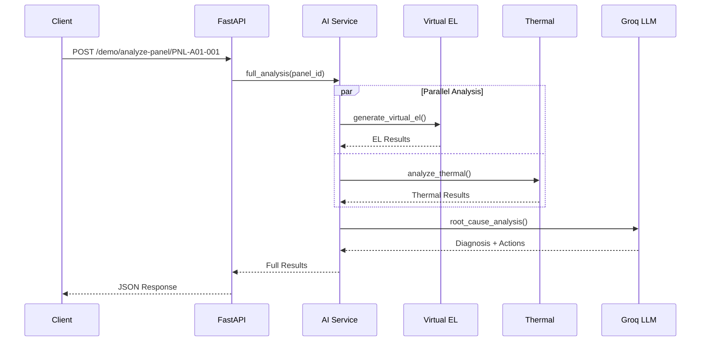
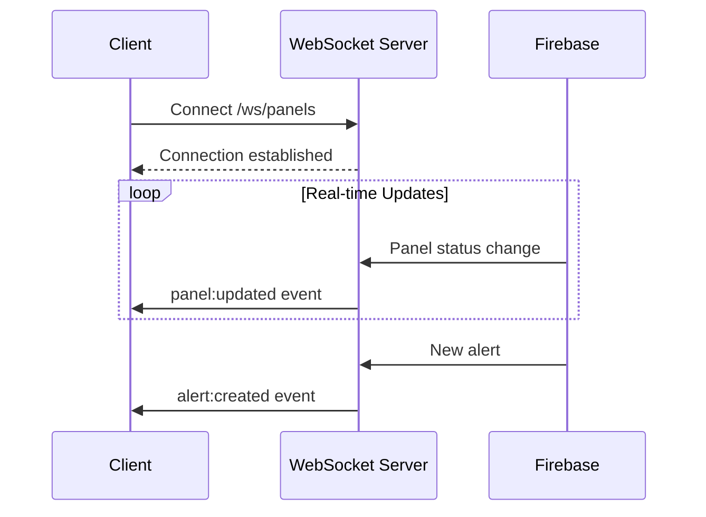

# 📡 HELIOS AI - API Reference

## Base URL

```
Development: http://localhost:8000/api
Production:  https://helios-api.railway.app/api
```

---

## Authentication

Currently, the API uses CORS-based protection. Production deployment will include API key authentication.

```http
Authorization: Bearer <API_KEY>
```

---

## Endpoints Overview



---

## Panel Endpoints

### GET /api/panels

Retrieve all panels with current status.

**Request:**
```http
GET /api/panels HTTP/1.1
Host: localhost:8000
```

**Response:**
```json
{
  "success": true,
  "data": [
    {
      "id": "PNL-A01-001",
      "row": 1,
      "position": 1,
      "status": "healthy",
      "voltage": 32.5,
      "current": 8.2,
      "power": 266.5,
      "temperature": 45.2,
      "efficiency": 96.5,
      "diagnosis": "Operating normally",
      "lastUpdated": "2026-02-01T14:30:00Z"
    }
  ],
  "count": 247
}
```

**Status Codes:**
| Code | Description |
|------|-------------|
| 200 | Success |
| 500 | Server Error |

---

### GET /api/panels/{panel_id}

Retrieve detailed information for a specific panel.

**Request:**
```http
GET /api/panels/PNL-A01-001 HTTP/1.1
Host: localhost:8000
```

**Path Parameters:**
| Parameter | Type | Description |
|-----------|------|-------------|
| panel_id | string | Panel identifier (e.g., PNL-A01-001) |

**Response:**
```json
{
  "success": true,
  "data": {
    "id": "PNL-A01-001",
    "row": 1,
    "position": 1,
    "status": "warning",
    "voltage": 28.3,
    "current": 7.8,
    "power": 220.7,
    "temperature": 52.1,
    "efficiency": 84.2,
    "diagnosis": "Hotspot detected in cell group B",
    "lastUpdated": "2026-02-01T14:30:00Z",
    "metadata": {
      "manufacturer": "Canadian Solar",
      "model": "CS6P-265M",
      "installDate": "2024-03-15",
      "warrantyExpiry": "2049-03-15"
    }
  }
}
```

---

## Alert Endpoints

### GET /api/alerts

Retrieve all active alerts.

**Request:**
```http
GET /api/alerts HTTP/1.1
Host: localhost:8000
```

**Query Parameters:**
| Parameter | Type | Default | Description |
|-----------|------|---------|-------------|
| severity | string | all | Filter by severity (critical, high, medium, low) |
| resolved | boolean | false | Include resolved alerts |
| limit | integer | 50 | Maximum alerts to return |

**Response:**
```json
{
  "success": true,
  "data": [
    {
      "alertId": "ALT-001",
      "panelId": "PNL-A03-012",
      "severity": "critical",
      "message": "Severe hotspot detected - Immediate action required",
      "type": "thermal",
      "resolved": false,
      "timestamp": "2026-02-01T14:25:00Z",
      "location": "Row 3, Position 12",
      "recommendation": "Schedule immediate inspection"
    }
  ],
  "count": 5
}
```

---

### POST /api/alerts/{alert_id}/resolve

Mark an alert as resolved.

**Request:**
```http
POST /api/alerts/ALT-001/resolve HTTP/1.1
Host: localhost:8000
Content-Type: application/json

{
  "resolution": "Panel repaired - bypass diode replaced",
  "technician": "John Doe"
}
```

**Response:**
```json
{
  "success": true,
  "message": "Alert ALT-001 resolved successfully"
}
```

---

## Statistics Endpoints

### GET /api/stats/farm-overview

Get aggregated farm statistics.

**Request:**
```http
GET /api/stats/farm-overview HTTP/1.1
Host: localhost:8000
```

**Response:**
```json
{
  "success": true,
  "data": {
    "totalPanels": 247,
    "healthyCount": 235,
    "warningCount": 9,
    "criticalCount": 3,
    "totalPowerKw": 62.45,
    "avgEfficiency": 94.2,
    "alerts": {
      "critical": 2,
      "high": 3,
      "medium": 5,
      "low": 8
    },
    "timestamps": {
      "dataAsOf": "2026-02-01T14:30:00Z",
      "nextUpdate": "2026-02-01T14:35:00Z"
    }
  }
}
```

---

## AI Analysis Endpoints

### POST /api/demo/analyze-panel/{panel_id}

Trigger comprehensive AI analysis for a panel.



**Request:**
```http
POST /api/demo/analyze-panel/PNL-A01-001 HTTP/1.1
Host: localhost:8000
```

**Response:**
```json
{
  "success": true,
  "data": {
    "panelId": "PNL-A01-001",
    "timestamp": "2026-02-01T14:30:00Z",
    "virtualElAnalysis": {
      "defects": [
        {
          "type": "microfracture",
          "location": "Cell B5",
          "severity": 0.65,
          "confidence": 0.89
        }
      ],
      "overallHealth": 0.82,
      "elImageUrl": "https://storage.supabase.co/el/PNL-A01-001.png"
    },
    "thermalAnalysis": {
      "maxTemperature": 52.1,
      "avgTemperature": 45.8,
      "hotspots": [
        {
          "location": "Cell B5-B6",
          "temperature": 52.1,
          "severity": "moderate"
        }
      ],
      "complianceIEC62446": true
    },
    "rootCauseAnalysis": {
      "primaryCause": "Cell microfracture causing localized resistance increase",
      "confidence": 0.87,
      "contributingFactors": [
        "Thermal stress from temperature cycling",
        "Potential manufacturing defect"
      ],
      "impactAssessment": {
        "currentPowerLoss": "12%",
        "projectedDegradation": "Progressive - recommend action within 30 days"
      },
      "recommendedActions": [
        {
          "priority": "high",
          "action": "Schedule module replacement",
          "deadline": "30 days",
          "estimatedCost": "₹8,500"
        }
      ]
    },
    "analysisTime": {
      "virtualEl": 1.2,
      "thermal": 0.8,
      "rootCause": 2.3,
      "total": 4.3
    }
  }
}
```

**Status Codes:**
| Code | Description |
|------|-------------|
| 200 | Analysis completed successfully |
| 404 | Panel not found |
| 429 | Rate limit exceeded |
| 500 | Analysis failed |

---

## Error Responses

All endpoints return consistent error format:

```json
{
  "success": false,
  "error": {
    "code": "PANEL_NOT_FOUND",
    "message": "Panel PNL-X99-999 does not exist",
    "details": {}
  }
}
```

**Common Error Codes:**
| Code | HTTP Status | Description |
|------|-------------|-------------|
| PANEL_NOT_FOUND | 404 | Requested panel doesn't exist |
| INVALID_PANEL_ID | 400 | Panel ID format invalid |
| ANALYSIS_FAILED | 500 | AI analysis error |
| RATE_LIMITED | 429 | Too many requests |
| DB_CONNECTION_ERROR | 503 | Database unavailable |

---

## Rate Limits

| Endpoint | Limit |
|----------|-------|
| Panel reads | 100/min |
| Alert operations | 30/min |
| AI Analysis | 10/min |

---

## WebSocket Events (Future)



---

## SDK Examples

### JavaScript/TypeScript

```javascript
import axios from 'axios';

const heliosApi = axios.create({
  baseURL: 'https://helios-api.railway.app/api',
  headers: {
    'Authorization': 'Bearer YOUR_API_KEY'
  }
});

// Get all panels
const panels = await heliosApi.get('/panels');

// Run AI analysis
const analysis = await heliosApi.post('/demo/analyze-panel/PNL-A01-001');
```

### Python

```python
import requests

BASE_URL = "https://helios-api.railway.app/api"
headers = {"Authorization": "Bearer YOUR_API_KEY"}

# Get farm statistics
response = requests.get(f"{BASE_URL}/stats/farm-overview", headers=headers)
stats = response.json()

# Analyze specific panel
response = requests.post(
    f"{BASE_URL}/demo/analyze-panel/PNL-A01-001",
    headers=headers
)
analysis = response.json()
```

---

*Last Updated: February 2026*
]]>
