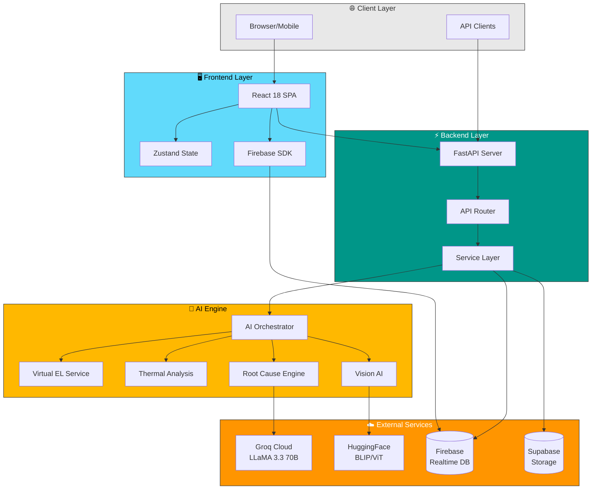
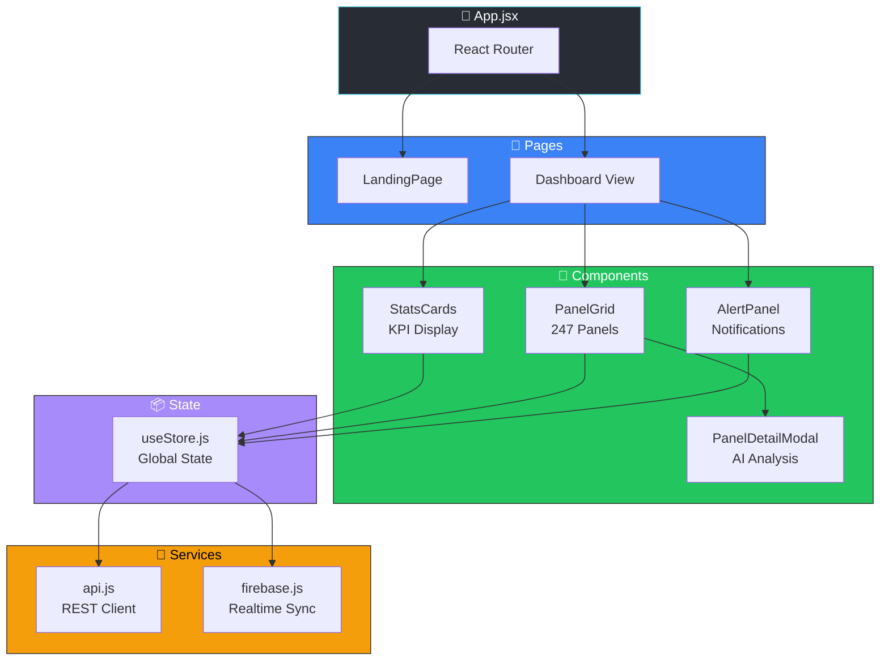
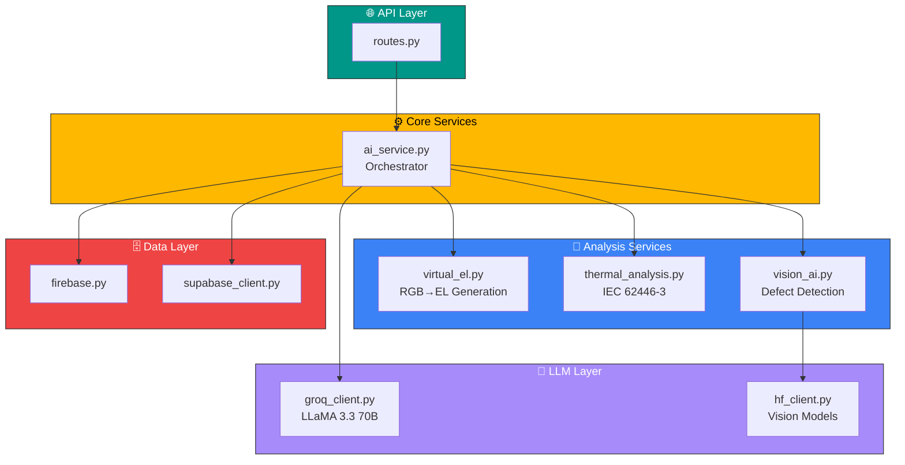
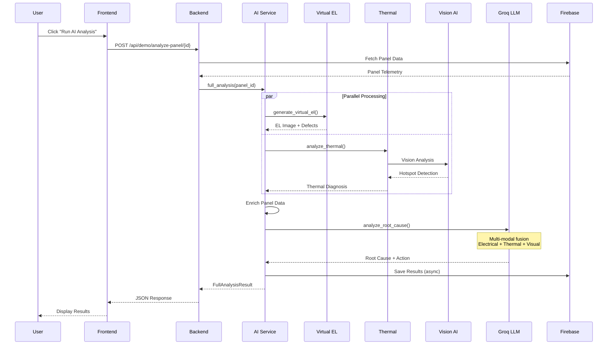
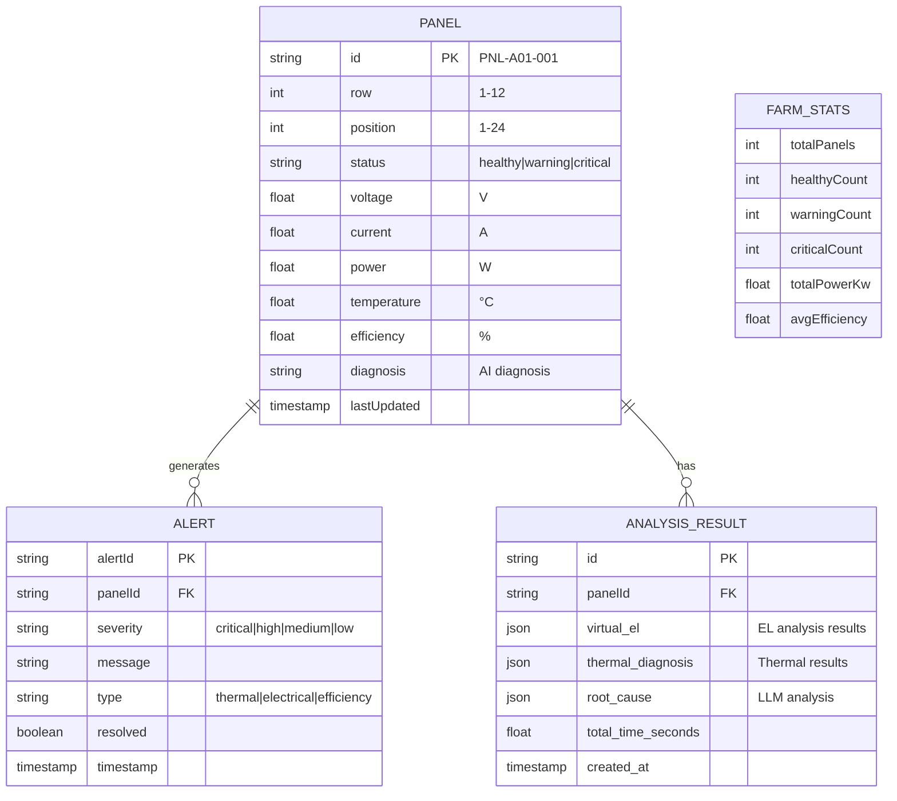
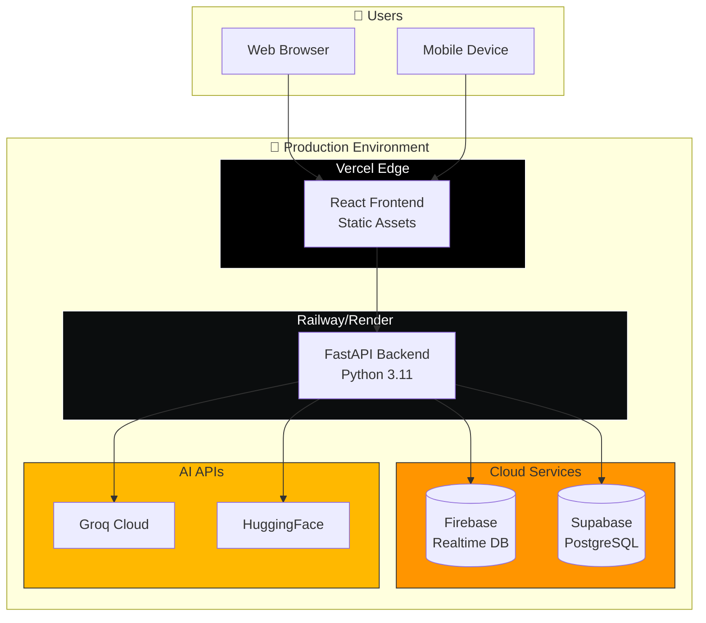

# 🏗️ HELIOS AI - System Architecture

## Overview

HELIOS AI follows a **microservices-inspired architecture** with clear separation between frontend, backend, and AI services.

---

## High-Level Architecture

---

## Component Architecture

### Frontend Components

### Backend Services

---

## AI Analysis Pipeline

---

## Data Models

---

## Deployment Architecture

---

## Security Architecture

```mermaid
flowchart LR
    subgraph Client["Client"]
        Browser[Browser]
    end
    
    subgraph Edge["Edge/CDN"]
        WAF[Web Application<br/>Firewall]
        CDN[CDN Cache]
    end
    
    subgraph API["API Gateway"]
        CORS[CORS Middleware]
        RateLimit[Rate Limiting]
        Auth[API Key Auth]
    end
    
    subgraph Backend["Backend"]
        Validation[Input Validation]
        Sanitization[Data Sanitization]
        Services[Business Logic]
    end
    
    subgraph Data["Data Layer"]
        Encryption[Encryption at Rest]
        Firebase[(Firebase)]
    end
    
    Browser --> WAF
    WAF --> CDN
    CDN --> CORS
    CORS --> RateLimit
    RateLimit --> Auth
    Auth --> Validation
    Validation --> Sanitization
    Sanitization --> Services
    Services --> Encryption
    Encryption --> Firebase
    
    style Edge fill:#EF4444,stroke:#333,color:#fff
    style API fill:#F59E0B,stroke:#333,color:#000
    style Backend fill:#22C55E,stroke:#333,color:#fff
    style Data fill:#3B82F6,stroke:#333,color:#fff
```

---

## Technology Stack Summary

| Layer | Technology | Purpose |
|-------|------------|---------|
| **Frontend** | React 18.3 | UI Framework |
| **State** | Zustand | Global State Management |
| **Styling** | Tailwind CSS 4.1 | Utility-First CSS |
| **Animation** | Framer Motion | UI Animations |
| **Backend** | FastAPI | REST API Framework |
| **Runtime** | Python 3.11 | Backend Language |
| **LLM** | Groq (LLaMA 3.3 70B) | Root Cause Analysis |
| **Vision** | HuggingFace (BLIP) | Image Understanding |
| **Database** | Firebase Realtime | Panel Telemetry |
| **Storage** | Supabase | AI Results Archive |
| **Build** | Vite | Frontend Build Tool |

---

## Scaling Considerations

1. **Horizontal Scaling**: Backend can be deployed across multiple instances
2. **Caching**: Firebase provides built-in caching for read operations
3. **Async Processing**: AI analysis runs asynchronously to prevent blocking
4. **Rate Limiting**: Groq API calls are rate-limited to manage costs
5. **CDN**: Static assets served via CDN for global performance

---

*Last Updated: February 2026*
]]>
