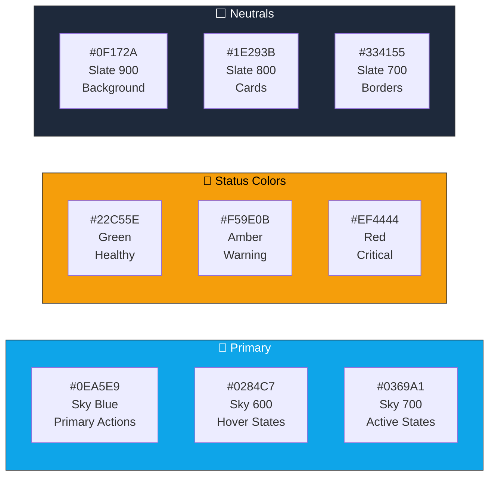
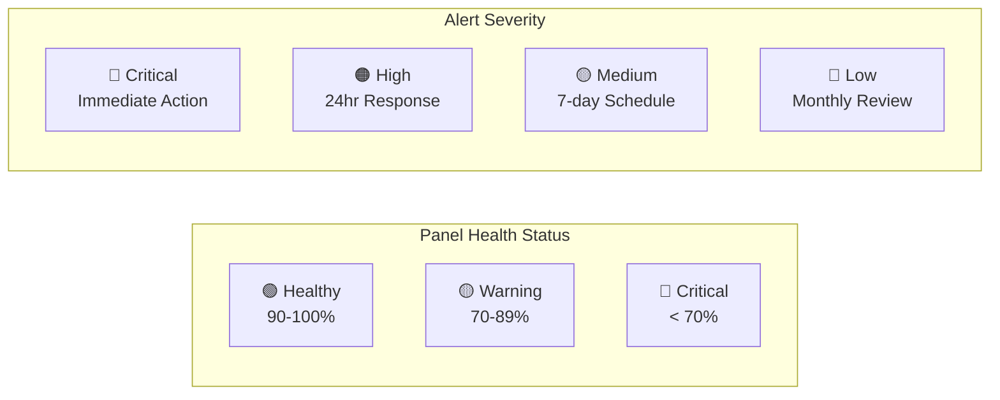
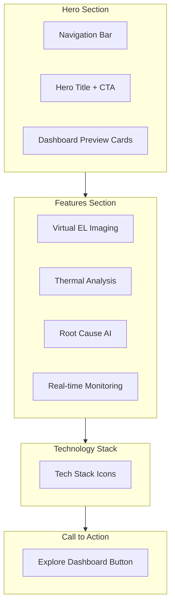
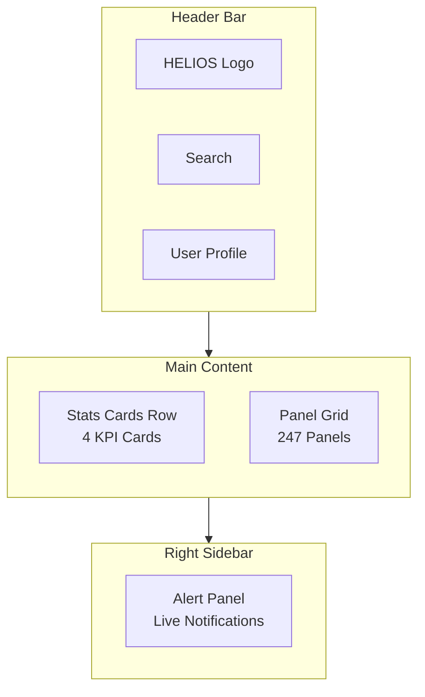
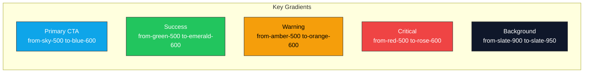
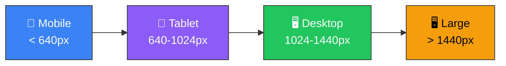
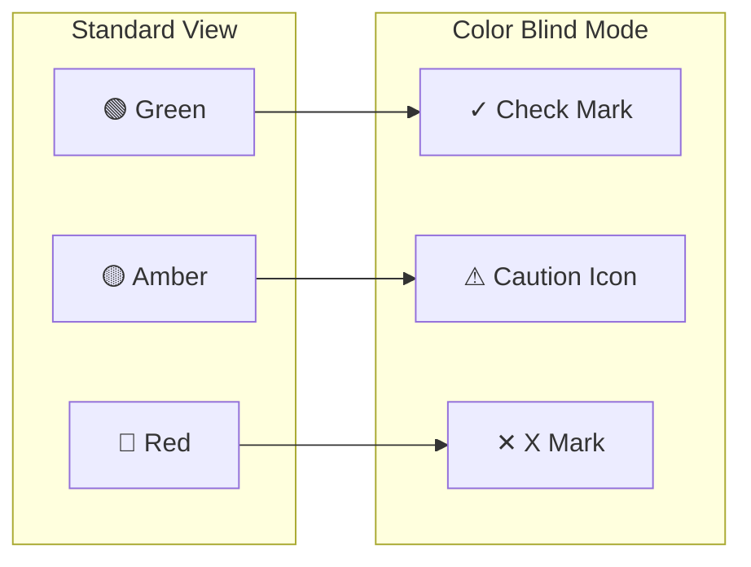

# 🎨 HELIOS AI - Design System

## Design Philosophy

HELIOS AI follows an **Enterprise-Grade Industrial Design** language, combining professional aesthetics with high-information density for solar farm operators.

---

## Brand Identity

### Logo

```
██╗  ██╗███████╗██╗     ██╗ ██████╗ ███████╗     █████╗ ██╗
██║  ██║██╔════╝██║     ██║██╔═══██╗██╔════╝    ██╔══██╗██║
███████║█████╗  ██║     ██║██║   ██║███████╗    ███████║██║
██╔══██║██╔══╝  ██║     ██║██║   ██║╚════██║    ██╔══██║██║
██║  ██║███████╗███████╗██║╚██████╔╝███████║    ██║  ██║██║
╚═╝  ╚═╝╚══════╝╚══════╝╚═╝ ╚═════╝ ╚══════╝    ╚═╝  ╚═╝╚═╝
```

**HELIOS** - Named after the Greek god of the Sun, representing our mission to illuminate solar panel health through AI.

### Color Palette



### Typography

| Element | Font | Weight | Size |
|---------|------|--------|------|
| Hero Title | System UI | Bold (700) | 56-72px |
| Section Headers | System UI | Semi-bold (600) | 32-40px |
| Card Titles | System UI | Medium (500) | 18-20px |
| Body Text | System UI | Normal (400) | 14-16px |
| Labels/Captions | System UI | Medium (500) | 12px |
| Monospace (Data) | JetBrains Mono | Normal (400) | 14px |

---

## Component Library

### Status Indicators



### Card Designs

#### Metric Card
```
┌──────────────────────────────────────────┐
│  ⚡ Total Power                          │
│                                          │
│    62.45 kW                            │
│    ████████████████░░░░  78%            │
│    ▲ 5.2% from yesterday                │
└──────────────────────────────────────────┘
```

#### Panel Tile
```
┌────────────────────────────────────────┐
│  🟢 PNL-A01-001                       │
│  ─────────────────────────────        │
│  ⚡ 266.5W    🌡️ 45.2°C             │
│  ─────────────────────────────        │
│  Efficiency: ████████████ 96.5%       │
└────────────────────────────────────────┘
```

---

## Page Layouts

### Landing Page Structure



### Dashboard Layout



---

## Animation Guidelines

### Timing Functions

```css
/* Standard easing curves */
--ease-in-out: cubic-bezier(0.4, 0, 0.2, 1);  /* General UI */
--ease-out: cubic-bezier(0, 0, 0.2, 1);        /* Elements entering */
--ease-in: cubic-bezier(0.4, 0, 1, 1);         /* Elements exiting */
--spring: cubic-bezier(0.68, -0.55, 0.265, 1.55); /* Bouncy */
```

### Duration Standards

| Animation Type | Duration |
|----------------|----------|
| Micro (hover states) | 150ms |
| Standard (transitions) | 300ms |
| Elaborate (modals) | 400ms |
| Complex (page transitions) | 500ms |

### Framer Motion Presets

```javascript
// Fade In Up
const fadeInUp = {
  initial: { opacity: 0, y: 20 },
  animate: { opacity: 1, y: 0 },
  transition: { duration: 0.3 }
};

// Stagger Children
const staggerContainer = {
  animate: {
    transition: {
      staggerChildren: 0.1
    }
  }
};

// Scale on Hover
const scaleHover = {
  whileHover: { scale: 1.02 },
  whileTap: { scale: 0.98 }
};
```

---

## Visual Effects

### Glassmorphism

```css
/* Glass card effect */
.glass-card {
  background: rgba(255, 255, 255, 0.1);
  backdrop-filter: blur(10px);
  border: 1px solid rgba(255, 255, 255, 0.1);
  border-radius: 16px;
}
```

### Gradients



### Glow Effects

```css
/* Status glow */
.healthy-glow { box-shadow: 0 0 20px rgba(34, 197, 94, 0.3); }
.warning-glow { box-shadow: 0 0 20px rgba(245, 158, 11, 0.3); }
.critical-glow { box-shadow: 0 0 20px rgba(239, 68, 68, 0.3); }

/* Pulsing critical indicator */
@keyframes critical-pulse {
  0%, 100% { box-shadow: 0 0 20px rgba(239, 68, 68, 0.3); }
  50% { box-shadow: 0 0 30px rgba(239, 68, 68, 0.6); }
}
```

---

## Responsive Breakpoints



### Grid System

| Screen | Columns | Panel Grid |
|--------|---------|------------|
| Mobile | 1 | 2 panels/row |
| Tablet | 2 | 4 panels/row |
| Desktop | 3 | 8 panels/row |
| Large | 4 | 12 panels/row |

---

## Accessibility

### WCAG 2.1 AA Compliance

- **Color Contrast**: Minimum 4.5:1 for text
- **Focus States**: Visible focus rings on all interactive elements
- **Keyboard Navigation**: Full keyboard accessibility
- **Screen Reader**: Proper ARIA labels and roles
- **Reduced Motion**: Respects `prefers-reduced-motion`

### Color Blind Safe Palette



---

## Icon System

Using **Heroicons** and **Lucide React** for consistent iconography:

| Category | Icons |
|----------|-------|
| Navigation | `Home`, `Menu`, `Search`, `Settings` |
| Status | `CheckCircle`, `AlertTriangle`, `XCircle` |
| Energy | `Zap`, `Sun`, `Battery`, `Thermometer` |
| Actions | `Play`, `Refresh`, `Download`, `Share` |
| Data | `TrendingUp`, `TrendingDown`, `Activity` |

---

## Dark Mode (Default)

HELIOS AI primarily uses a dark theme for:
1. **Reduced Eye Strain**: Operators monitoring 24/7
2. **Better Data Visibility**: High contrast for metrics
3. **Energy Efficiency**: Lower power on OLED displays
4. **Professional Aesthetic**: Industrial monitoring standard

---

*Design System Version: 1.0 | Last Updated: February 2026*
]]>
