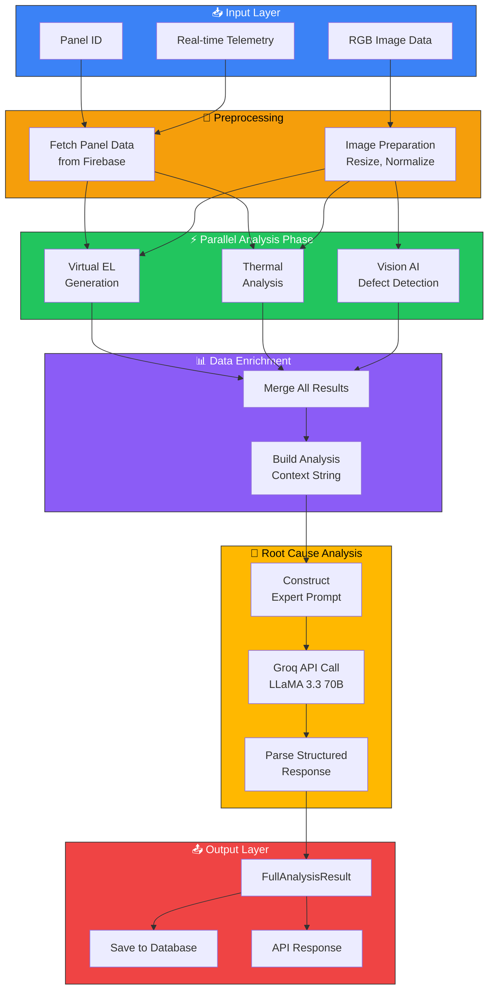
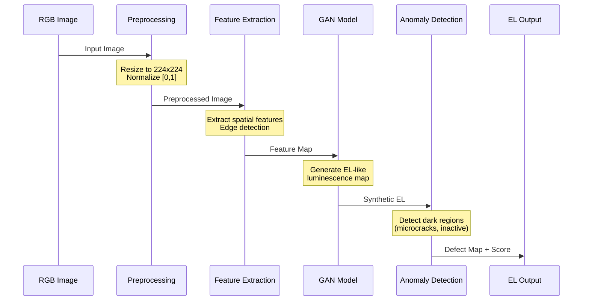
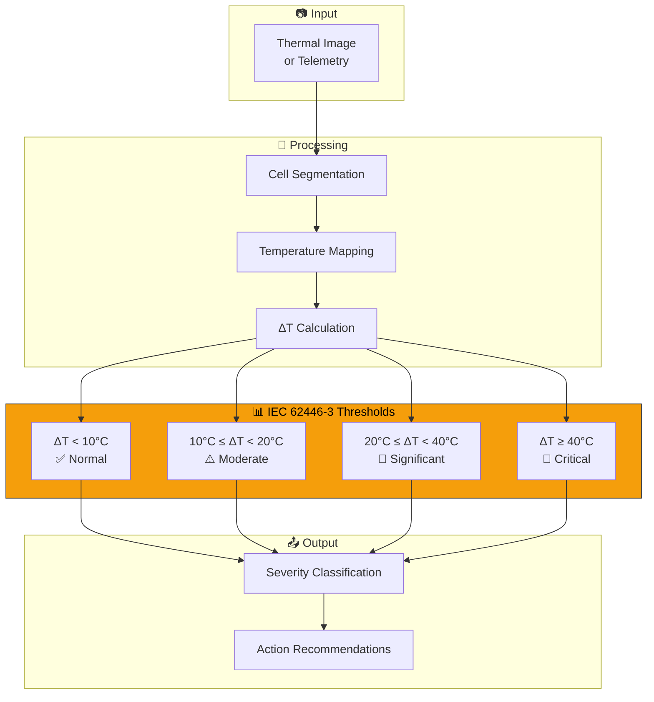
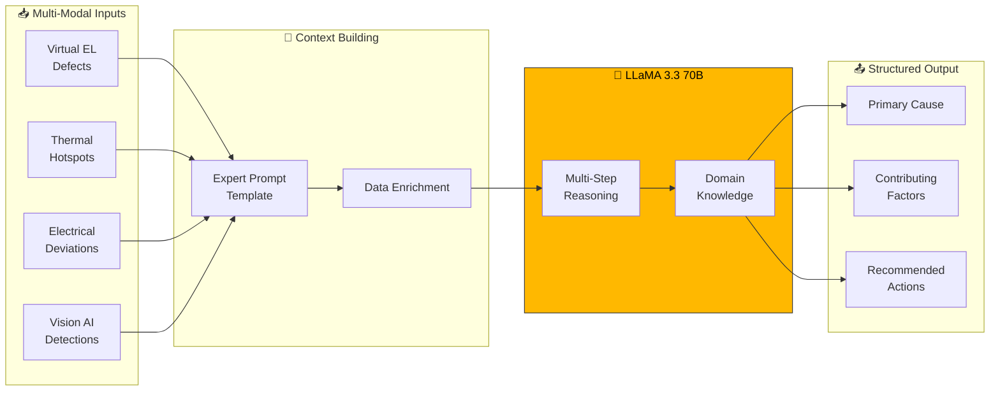
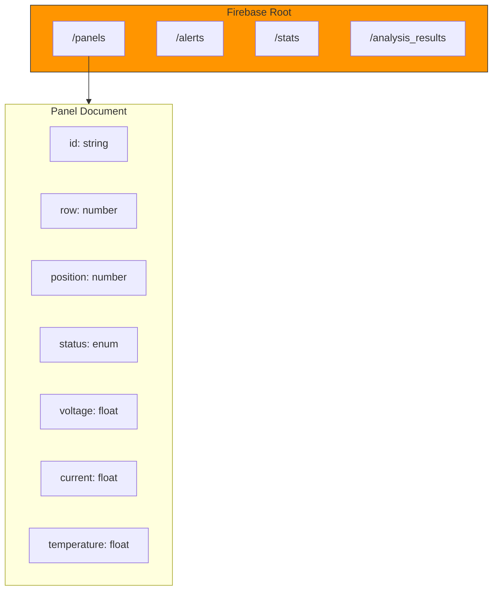
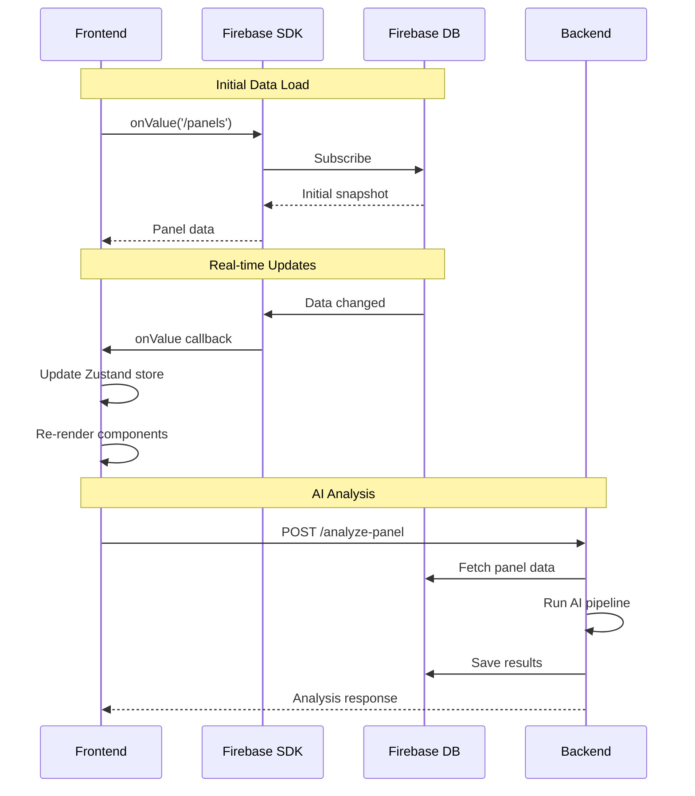
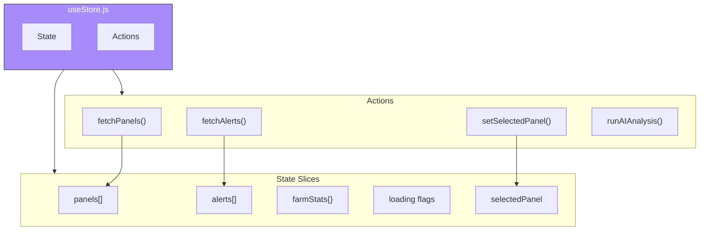
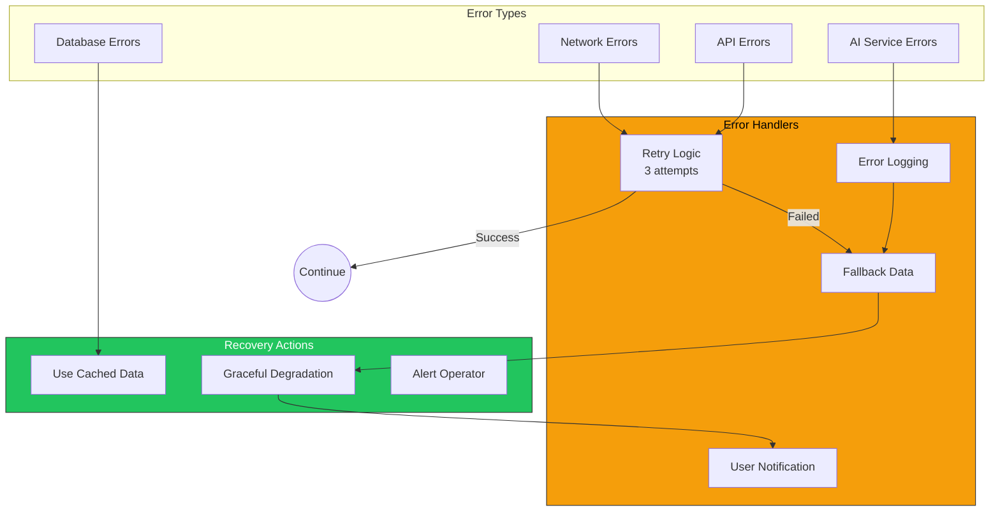
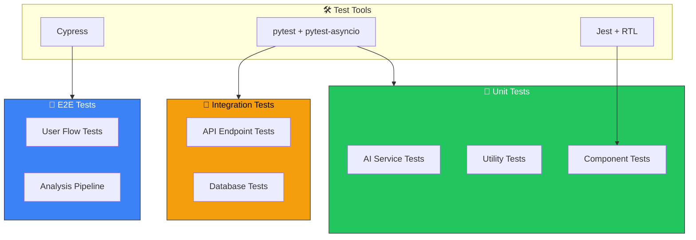

# ⚙️ HELIOS AI - Implementation Guide

## Overview

This document provides comprehensive implementation details for the HELIOS AI platform, including AI pipeline architecture, algorithm explanations, and code flow diagrams.

---

## AI Analysis Pipeline

### Full Analysis Flow



---

## Virtual EL Imaging

### Algorithm Overview

Virtual Electroluminescence (EL) imaging generates EL-like diagnostic images from standard RGB photographs.



### Implementation Code

```python
class VirtualELService:
    """Generates virtual EL images from RGB photographs."""
    
    def __init__(self):
        self.model_name = "facebook/detr-resnet-50"
        self.processor = None
        self.model = None
    
    async def generate_virtual_el(
        self, 
        panel_id: str, 
        image_data: Optional[bytes] = None
    ) -> VirtualELResult:
        """
        Generate virtual EL image and detect defects.
        
        Args:
            panel_id: Panel identifier
            image_data: Optional RGB image bytes
            
        Returns:
            VirtualELResult with defects and health score
        """
        # Step 1: Simulate EL characteristics
        el_characteristics = self._simulate_el_response(panel_id)
        
        # Step 2: Detect anomalies
        defects = self._detect_anomalies(el_characteristics)
        
        # Step 3: Calculate health score
        health_score = self._calculate_health(defects)
        
        return VirtualELResult(
            defects=defects,
            overall_health=health_score,
            el_image_url=f"generated/el/{panel_id}.png"
        )
```

---

## Thermal Analysis

### IEC 62446-3 Compliance



### Hotspot Detection Algorithm

```python
def _classify_thermal_anomaly(self, temperature: float, ambient: float = 25.0) -> dict:
    """
    Classify thermal anomaly per IEC 62446-3 standards.
    
    ΔT Thresholds:
    - < 10°C: Normal operation
    - 10-20°C: Moderate - monitor closely
    - 20-40°C: Significant - schedule inspection
    - ≥ 40°C: Critical - immediate action
    """
    delta_t = temperature - ambient
    
    if delta_t < 10:
        return {"severity": "normal", "action": "none"}
    elif delta_t < 20:
        return {"severity": "moderate", "action": "monitor"}
    elif delta_t < 40:
        return {"severity": "significant", "action": "schedule_inspection"}
    else:
        return {"severity": "critical", "action": "immediate"}
```

---

## Root Cause Analysis Engine

### Multi-Modal Fusion



### Expert System Prompt

```python
ROOT_CAUSE_PROMPT = """
You are an expert solar panel diagnostic AI with deep knowledge of:
- Photovoltaic cell physics and degradation mechanisms
- Thermal imaging analysis per IEC 62446-3
- Electroluminescence (EL) imaging interpretation
- Common failure modes: PID, LID, hotspots, microcracks

PANEL DIAGNOSTIC DATA:
{enriched_panel_data}

VIRTUAL EL ANALYSIS:
{virtual_el_results}

THERMAL ANALYSIS:
{thermal_results}

Provide:
1. PRIMARY ROOT CAUSE with confidence %
2. CONTRIBUTING FACTORS (list)
3. IMPACT ASSESSMENT (current loss, degradation trajectory)
4. PRIORITIZED ACTIONS with timelines

Format as structured JSON.
"""
```

### Groq API Integration

```mermaid
sequenceDiagram
    participant AS as AI Service
    participant GC as Groq Client
    participant API as Groq API
    participant LLM as LLaMA 3.3 70B
    
    AS->>GC: analyze_root_cause(data)
    GC->>GC: Build prompt template
    GC->>GC: Add system message
    
    GC->>API: POST /chat/completions
    Note over API: Headers:<br/>Authorization: Bearer {key}
    
    API->>LLM: Forward request
    Note over LLM: Model: llama-3.3-70b-versatile<br/>Temperature: 0.3<br/>Max Tokens: 2048
    
    LLM-->>API: Generated response
    API-->>GC: JSON response
    
    GC->>GC: Parse response
    GC->>GC: Extract structured data
    GC-->>AS: RootCauseResult
```



---

## Database Schema

### Firebase Realtime Database Structure



### Data Flow



---

## State Management

### Zustand Store Architecture



### Store Implementation

```javascript
// store/useStore.js
import { create } from 'zustand';

const useStore = create((set, get) => ({
  // State
  panels: [],
  alerts: [],
  farmStats: null,
  selectedPanel: null,
  loading: {
    panels: false,
    alerts: false,
    analysis: false
  },
  
  // Actions
  fetchPanels: async () => {
    set({ loading: { ...get().loading, panels: true }});
    const panels = await api.getPanels();
    set({ panels, loading: { ...get().loading, panels: false }});
  },
  
  runAIAnalysis: async (panelId) => {
    set({ loading: { ...get().loading, analysis: true }});
    const result = await api.analyzePanel(panelId);
    // Update panel in store
    const panels = get().panels.map(p => 
      p.id === panelId ? { ...p, ...result } : p
    );
    set({ panels, loading: { ...get().loading, analysis: false }});
    return result;
  }
}));
```

---

## Error Handling Strategy



---

## Performance Optimizations

### Parallel Processing

```python
async def full_analysis(self, panel_id: str) -> FullAnalysisResult:
    """Run complete AI analysis with parallel processing."""
    
    # Parallel execution of independent analyses
    virtual_el_task = asyncio.create_task(
        self._virtual_el_analysis(panel_id)
    )
    thermal_task = asyncio.create_task(
        self._thermal_analysis(panel_id)
    )
    
    # Await both results
    virtual_el_result, thermal_result = await asyncio.gather(
        virtual_el_task,
        thermal_task
    )
    
    # Sequential: Root cause needs results from above
    root_cause = await self._root_cause_analysis(
        panel_id,
        virtual_el_result,
        thermal_result
    )
    
    return FullAnalysisResult(
        virtual_el=virtual_el_result,
        thermal=thermal_result,
        root_cause=root_cause
    )
```

### React Optimizations

```javascript
// Memoized panel grid for 247 panels
const MemoizedPanelTile = memo(PanelTile, (prev, next) => 
  prev.panel.status === next.panel.status &&
  prev.panel.lastUpdated === next.panel.lastUpdated
);

// Virtual scrolling for large panel lists
import { FixedSizeGrid } from 'react-window';

const PanelGrid = ({ panels }) => (
  <FixedSizeGrid
    columnCount={12}
    rowCount={Math.ceil(panels.length / 12)}
    columnWidth={100}
    rowHeight={80}
  >
    {({ columnIndex, rowIndex, style }) => (
      <MemoizedPanelTile 
        panel={panels[rowIndex * 12 + columnIndex]}
        style={style}
      />
    )}
  </FixedSizeGrid>
);
```

---

## Testing Strategy



---

## Deployment Checklist

- [ ] Environment variables configured
- [ ] Firebase credentials set
- [ ] Groq API key active
- [ ] CORS origins updated for production
- [ ] Database rules configured
- [ ] Rate limiting enabled
- [ ] Error logging active
- [ ] Health check endpoint responding
- [ ] SSL certificates valid
- [ ] CDN configured for static assets

---

*Implementation Guide v1.0 | Last Updated: February 2026*
]]>
